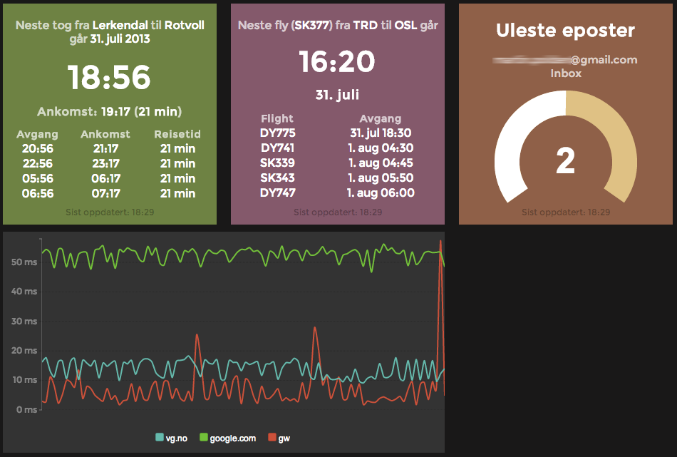

JARVIS
======

JARVIS is a dashboard framework designed to run on the Raspberry Pi.

It features live-updating widgets using
[server-sent events](https://en.wikipedia.org/wiki/Server-sent_events) and can be
easily extended to fit your needs.

Screenshots
-----------

Dependencies
------------
JARVIS requires Python 3.6+ to run.

Install requirements:

    pip install -r requirements.txt

For development it's recommended to use [virtualenv](https://virtualenv.pypa.io).

Configuration
-------------
All configuration of widgets is done in a single Python source file. The
configuration is specified by setting the `JARVIS_SETTINGS` environment
variable.

A sample config (`jarvis/config.py.sample`) is provided. This file can be used as a
starting point for your own configuration.

Copy `jarvis/config.py.sample` to `jarvis/config.py` and edit it to suit your needs.

Usage
-----
After installing dependencies and creating a config file, the app can be started
by running:

    JARVIS_SETTINGS=config.py make run

To start the app in debug mode, use:

    JARVIS_SETTINGS=config.py make debug

Run a job standalone and pretty-print output (useful for debugging):

    JARVIS_SETTINGS=config.py make run-job

Create Google API credentials (required for calendar and gmail widget):

    JARVIS_SETTINGS=config.py make google-api-auth

Create a new widget:

    make widget

Create a new dashboard:

    make dashboard

Widgets
-------
See [WIDGETS.md](docs/WIDGETS.md) for documentation on available widgets.

Deployment
----------
See [INSTALL.md](docs/INSTALL.md) for a basic deployment guide.

License
-------
Licensed under the MIT license. See the [LICENSE](LICENSE) file if you've never
seen it before.
